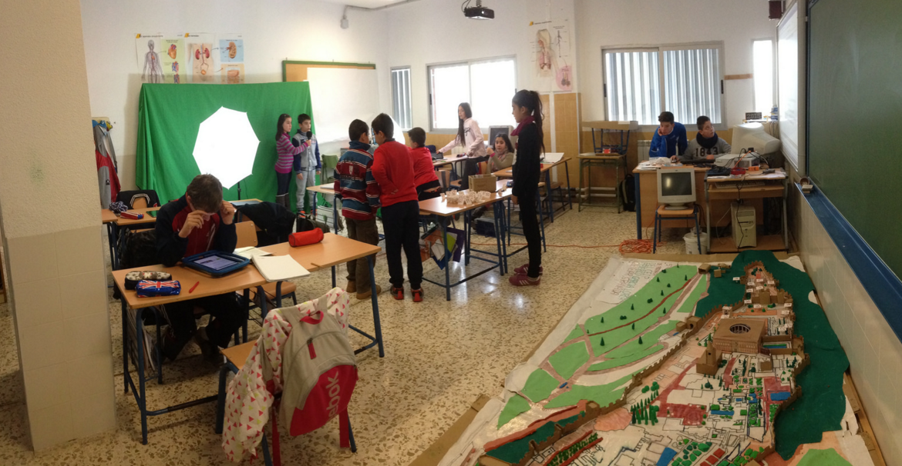

# Iniciación a la programación con Scratch (172319GE056)

## Curso del CEP de Linares

## Mayo de 2017

### José Antonio Vacas @javacasm

## https://github.com/javacasm/ScratchLinares

##  Todos trabajando

# Alhambra Mágica

[fotos](https://www.flickr.com/photos/fantasticoguevejar/sets/72157650743695171/)

## Todos haciendo algo distinto

* * *

¿Enseñamos programación?

# ¡No!

## Aprendemos a hacer, a escribir, a redactar, a explicar, a organizar, a calcular
Hacemos plástica, matemáticas, historia, lengua, ¿inglés?

* * *

# ¿Motivados?

# ¡¡¡Enganchados!!!
