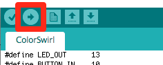
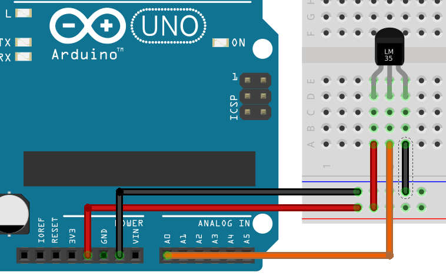
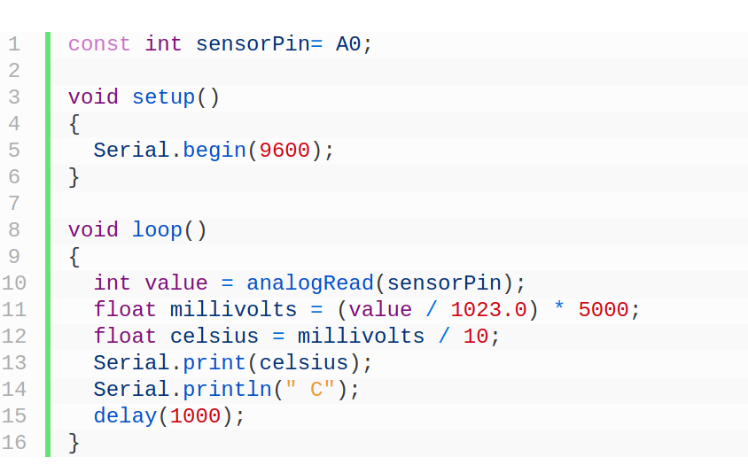
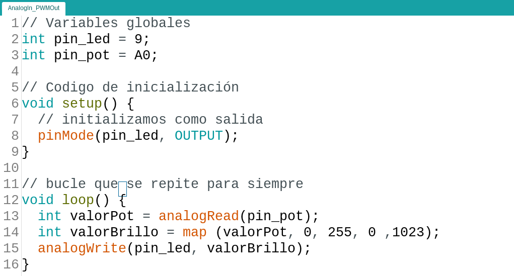

# Iniciación a Arduino

#### José Antonio Vacas @javacasm

##### [github.com/javacasm/CharlaArduinoTecnoteca](https://github.com/javacasm/CharlaArduinoTecnoteca)

!

# ¿Qué es arduino?

!

### Placa Arduino

### + Entorno de programación

### + Librerías (conjunto de código)

### + Gran documentación y ejemplos

!

## Totalmente OpenSource

* Diseño
* Documentación
* Codigo

### [Open Source by @psicobyte_ ](http://www.psicobyte.com/descargas/MasterProfesorado.pdf)

!

## ¿y si no tengo arduino?

[Simuladores](https://github.com/javacasm/ArduinoBasico/blob/master/1.5%20Y%20si%20no%20tengo:%20Emuladores%20y%20simuladores.html.md)

tinkercad.com

!

# Dónde comprar

### En España

* [Inven.es](http://inven.es)
* [Electan.com](http://www.electan.com/)
* [Bricogeek.com](http://www.bricogeek.com/shop/)
* [Cooking Hack](http://www.cooking-hacks.com/)

### Fuera de España

* [Arduino](http://store.arduino.cc/eu/index.php)
* [Sparkfun](http://www.sparkfun.com/)
* [Adafruit](http://adafruit.com/)

!

# Qué comprar
-----------

 Un buen kit básico ha de tener al menos:

-   resistencias variadas,
-   led de diferentes colores,
-   ldr (células fotoeléctricas),
-   sensores de temperatura: DHT11, TMP36
-   transistores,
-   un par de servos 9g,
-   algún motor pequeño
-   una breadboard,
-   cables de colores con conectores machos y hembras
-   arduino Uno

!

# Software:

IDE

[arduino.cc/en/Main/Software](http://www.arduino.cc/en/Main/Software)

(instalación de driver en Windows) jiji

!

# ¿Qué es arduino?

!

# ¿Qué tiene arduino?

Microcontrolador ATMega328

* 14 Entradas/Salidas digitales
* 6 Entradas Analógicas 0-5V de 10bits
* 32Kb de Memoria de programa
* 2Kb de Memoria RAM
* 512 bytes de EEPROM
* CPU a 16MHz
* Funciona a 5V
* Conexión USB

!

# Primera prueba

Ejemplo 1. Básicos - > Blink

    digitalWrite(pin_led,Estado); // Estado HIGH o LOW

!

### Programamos la placa

* Conectamos la placa con el cable USB

(instalación de driver en Windows) jiji

En el menú herramientas

* Seleccionamos el puerto
* Seleccionamos el tipo de placa
* Pulsamos el botón subir

!

## Código

Veamos el código ....

!

# Led en el pin 9

## ¡¡¡ Resistencia Siempre !!!

[Breadboards](./images/Sidekick_Breadboard_Internal_Connections.jpg)

!

## Código para led en 9

!

## Cuidados

* Montaje sin alimentación
* Led tiene polaridad
* Resistencia de al menos 220 Ohmios

!
# Programamos C++

## Está preparado para que sea sencillo

!

## Ejercicio: Kit o Cylon

#### 5 leds (con sus 5 resistencias)

[Código](./images/kit.png)

!

# No todo es digital

    analogWrite(pin_led,brillo); // brillo entre 0 y 255

(Es un truco llamado [PWM](./images/0_LPC1768_PWM.gif))

0 ----- 100 %

0 ----- 255

Ejemplo - > 1.Basic - > FADE

!

# Leemos voltajes

    int valor = analogRead(pin_analogico);
    // valor entre 0 y 1023

Rangos de lectura

0 ------ 5V

0 ------ 1023

!

# Potenciómetro

Ejemplos -> 3. Analog -> AnalogInput

!

# Lo sensores igual

#### Convertiremos voltaje a magnitud física

### Ejemplo TMP36 o LM35

!

## LM35 - Montaje

!

## LM35 - Codigo

10 mV/C

by Luis Llamas [luisllamas.es](https://www.luisllamas.es/medir-temperatura-con-arduino-y-sensor-lm35/)

!

## Ejercicio:
### Ccontrolar brillo con potenciometro

!

#### Ejercicio: indicador de temperatura

* Leemos temperatura
* "Mapeamos" en brillo del led
* Usamos 2 leds (o led RGB) y
  * A más calor más rojo
  * A más frío más azul

!

#### Iindicador RGB temperatura

!

# Librerías

* Instalamos una librería
  * Gestor de librerías o Zip

* Usamos ejemplos
  * Servo -> Servo
  * Pantalla LCD - > LiquidCrystal
  * Sensor DHT - > SimpleDHT

!

## ¿Más allá de Arduino?

#### ESP8266 o NodeMCU

!

Todos los esquemas con [Fritzing](http://fritzing.org/)

!

# Para aprender más...

#### &lt; publicidad &gt; by @javacasm

## udemy.com/arduino-cero

#### &lt; /publicidad &gt;

## aprendiendoarduino.com

## programarfacil.com

## programoergosum.com
