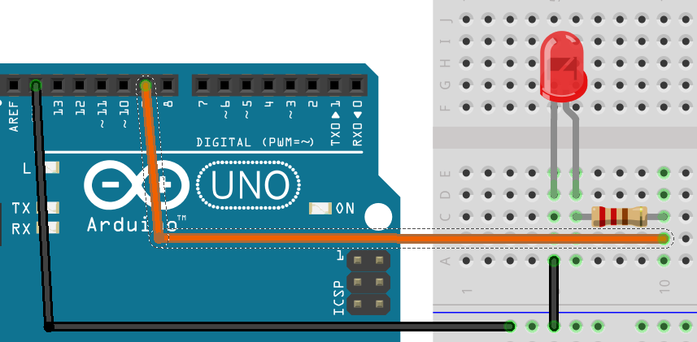
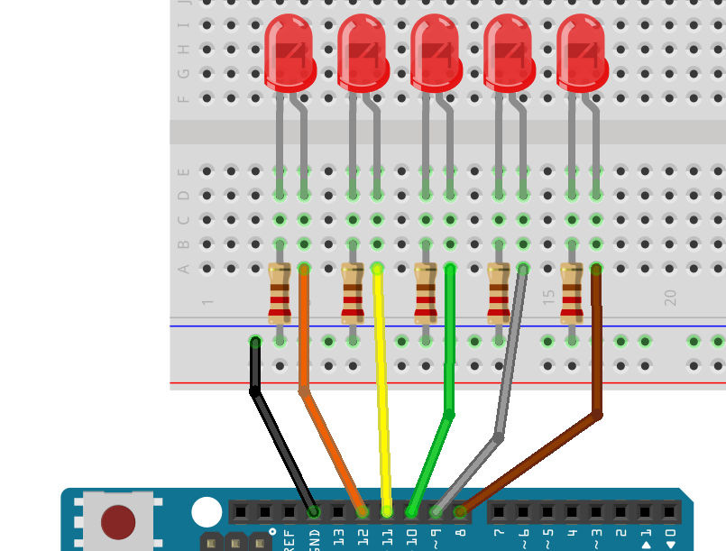
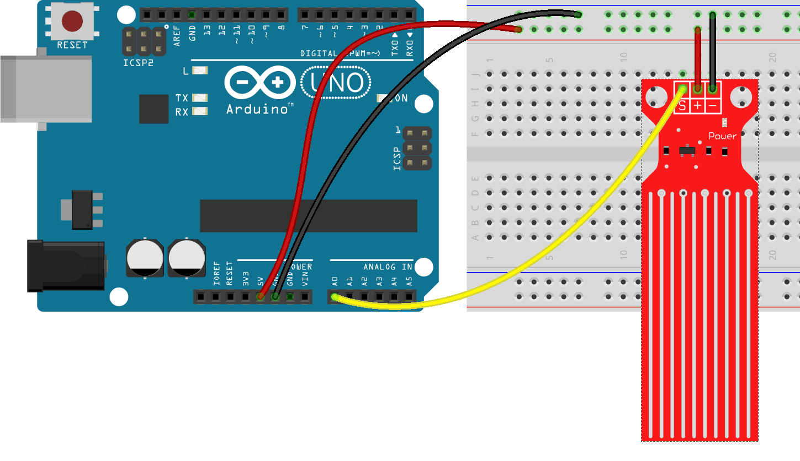
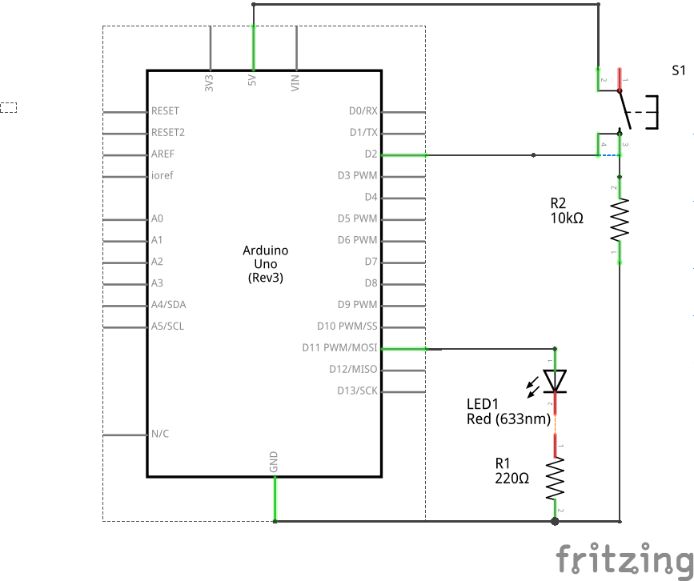

# Curso de Robótica con Scratch y Arduino

## CEP Motril

## Profesorado de Primaria y Secundaria

### José Antonio Vacas Martínez @javacasm

### 18 y 25 de Abril, 16 y 23 de Mayo

## https://github.com/javacasm/ScratchMotril

# ¿Qué es arduino?

### Placa Arduino

### + Entorno de programación

### + Librerías (conjunto de código)

### + Gran documentación y ejemplos

## Totalmente OpenSource

* Diseño
* Documentación
* Codigo

### [Open Source by @psicobyte_ ](http://www.psicobyte.com/descargas/MasterProfesorado.pdf)

## ¿y si no tengo arduino?

[Simuladores](https://github.com/javacasm/ArduinoBasico/blob/master/1.5%20Y%20si%20no%20tengo:%20Emuladores%20y%20simuladores.html.md)

[tinkercad.com](http://tinkercad.com)

# Software:

IDE

[arduino.cc/en/Main/Software](http://www.arduino.cc/en/Main/Software)

(instalación de driver en Windows) jiji

# ¿Qué es arduino?

# ¿Qué tiene arduino?

Microcontrolador ATMega328

* 14 Entradas/Salidas digitales
* 6 Entradas Analógicas 0-5V de 10bits
* 32Kb de Memoria de programa
* 2Kb de Memoria RAM
* 512 bytes de EEPROM
* CPU a 16MHz
* Funciona a 5V
* Conexión USB

# Primera prueba

Ejemplo 1. Básicos - > Blink

    digitalWrite(pin_led,Estado); // Estado HIGH o LOW

### Programamos la placa

* Conectamos la placa con el cable USB

(instalación de driver en Windows) jiji

En el menú herramientas

* Seleccionamos el puerto
* Seleccionamos el tipo de placa
* Pulsamos el botón subir

## Código

Veamos el código ....

# Led en el pin 9

## ¡¡¡ Resistencia Siempre !!!

[Breadboards](./images/Sidekick_Breadboard_Internal_Connections.jpg)

## Código para led en 9

## Cuidados

* Montaje sin alimentación
* Led tiene polaridad
* Resistencia de al menos 220 Ohmios

# Programamos C++

## Está preparado para que sea sencillo

## Ejercicio: Kit o Cylon

#### 5 leds (con sus 5 resistencias)

[Código](./images/kit.png)

# No todo es digital

    analogWrite(pin_led,brillo); // brillo entre 0 y 255

(Es un truco llamado [PWM](./images/0_LPC1768_PWM.gif))

0 ----- 100 %

0 ----- 255

Ejemplo - > 1.Basic - > FADE

# Leemos voltajes

    int valor = analogRead(pin_analogico);
    // valor entre 0 y 1023

Rangos de lectura

0 ------ 5V

0 ------ 1023

# Potenciómetro

Ejemplos -> 3. Analog -> AnalogInput

# Lo sensores igual

#### Convertiremos voltaje a magnitud física

### Ejemplo TMP36 o LM35

## LM35 - Montaje

## LM35 - Codigo

10 mV/C

by Luis Llamas [luisllamas.es](https://www.luisllamas.es/medir-temperatura-con-arduino-y-sensor-lm35/)

## Ejercicio:
### Ccontrolar brillo con potenciometro

#### Ejercicio: indicador de temperatura

* Leemos temperatura
* "Mapeamos" en brillo del led
* Usamos 2 leds (o led RGB) y
  * A más calor más rojo
  * A más frío más azul

#### Iindicador RGB temperatura

#### LDR (célula fotoeléctrica)

Ejemplo: activaremos un led al bajar de determinado nivel de luz

Ejemplo 2: Regular el nivel con un potenciómetro.  Documentarlo.

#### [Medida de humedad o salinidad](./codigo/Humedad_Saturacion_salina/Humedad_Saturacion_salina.ino)

* [Sistema de Riego](./codigo/Sistema_Riego/Sistema_Riego.ino)

* Fijar el umbral de riego mediante un potenciómetro

* Ahora podemos hacer que el valor del potenciometro regule el [valor de disparo del riego](./codigo/Sistema_Riego_REgulable/Sistema_Riego_REgulable.ino)

* Una vez montado el circuito calibramos los valores de humedad, lo que nos dará un valor de lo que consideramos seco VALOR_SECO y húmedo VALOR_MOJADO. Además definiremos un valor de HISTERESIS que evitará que se produzcan Enciendos/Apagados de manera rápida e intermitente

[Codigo](./codigo/Sistema_Riego_REgulable_calibrado/Sistema_Riego_REgulable_calibrado.ino)

#### Secuencias

  Una secuencia es un conjunto de instrucciones que se realiza en determinado orden.

  Ejemplos de secuencias son un semáforo, o el programador de una lavadora

  Trabajaremos con el ejemplo del semáforo

  

  En nuestro caso un pulsador hará el cambio entre los estados.

  Si el tiempo de espera entre los estados es alto y usamos delay() veremos que el sistema responde lentamente.

  Para ello dividiremos el tiempo de espera en esperas más cortas entre las que comprobaremos el estado del pulsador

        int duracion_rojo = 60000;
        int numero_iteraciones = 1000;
        for(int i = 0 ; i < numero_iteraciones ; i = i + 1 ){
          delay(duracion_rojo / numero_iteraciones);
          if (digitalRead(PIN_PULSADOR) == HIGH ){
             break;
          }
        }

####  Pulsadores

##### Detectar una pulsación

Debemos conectar el pin a GND para grantizar el estado LOW si está desconectado: PullDown

if(digitalRead(pinBoton)==HIGH)
{  .....}

Conectamos por medio de una resistencia (de 10kOhmios) el pin de arduino a GND de manera que cuando no esté activado el pulsador la patilla reciba 0V. Al pulsarlo se conectará a 5V

Es lo que se conoce como conexión Pull-Down

# Librerías

* Instalamos una librería
  * Gestor de librerías o Zip

* Usamos ejemplos
  * Servo -> Servo
  * Pantalla LCD - > LiquidCrystal
  * Sensor DHT - > SimpleDHT

## ¿Más allá de Arduino?

#### ESP8266 o NodeMCU

Todos los esquemas con [Fritzing](http://fritzing.org/)

# Para aprender más...

#### &lt; publicidad &gt; by @javacasm

## udemy.com/arduino-cero

#### &lt; /publicidad &gt;

## aprendiendoarduino.com

## programarfacil.com

## programoergosum.com

# Dónde comprar

### En España

* [Inven.es](http://inven.es)
* [Electan.com](http://www.electan.com/)
* [Bricogeek.com](http://www.bricogeek.com/shop/)
* [Cooking Hack](http://www.cooking-hacks.com/)

### Fuera de España

* [Arduino](http://store.arduino.cc/eu/index.php)
* [Sparkfun](http://www.sparkfun.com/)
* [Adafruit](http://adafruit.com/)

# Qué comprar
-----------

 Un buen kit básico ha de tener al menos:

-   resistencias variadas,
-   led de diferentes colores,
-   ldr (células fotoeléctricas),
-   sensores de temperatura: DHT11, TMP36
-   transistores,
-   un par de servos 9g,
-   algún motor pequeño
-   una breadboard,
-   cables de colores con conectores machos y hembras
-   arduino Uno
